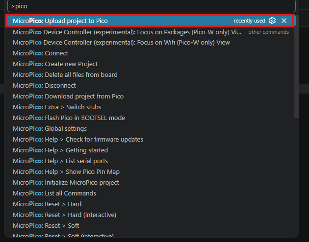
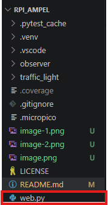
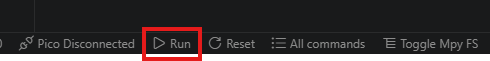
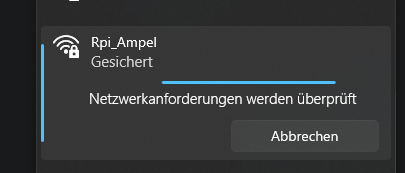
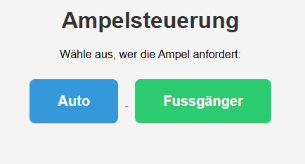

# Rpi_Ampel 🚦

A Raspberry Pi Pico-based traffic light controller with an interactive web
interface. Control traffic lights for cars and pedestrians via buttons
accessible through a local wireless access point.

## Features

- **Traffic Light Control**: Manage traffic lights with red, yellow, and green
  states
- **Car & Pedestrian Modes**: Separate traffic light systems for vehicles and
  pedestrians
- **Web Interface**: User-friendly web dashboard accessible via access point
- **Event-Driven Architecture**: Observer pattern for decoupled event handling
- **Wireless Access Point**: Built-in WiFi connectivity for remote control

## Project Structure

```
Rpi_Ampel/
├── web.py                    # Main webserver and access point setup
├── traffic_light/
│   ├── traffic_light.py      # TrafficLight class and state management
│   ├── turn_off.py           # Utility to disable traffic lights
│   └── test_traffic_light.py # Traffic light unit tests
├── observer/
│   ├── event_manager.py      # Event management system
│   └── test_observer.py      # Observer pattern tests
└── README.md
```

## Quick Start

### 1. Upload to Raspberry Pi Pico

- Open VS Code
- Press `Ctrl + Shift + P`
- Search for "pico"



### 2. Run the Application

- Open `web.py` in VS Code



- Click the **`> Run`** button in the bottom left corner to start the webserver
  and access point



### 3. Connect to the WiFi

- Look for the **"Rpi_Ampel"** WiFi network
- Connect with password: **"12345678"**



### 4. Control the Traffic Lights

- Open a web browser and navigate to the Pico's IP address
- Click the buttons to control the traffic lights:
  - **🚗 Auto** (Car): Controls the car traffic light
  - **🚶 Fußgänger** (Pedestrian): Controls the pedestrian traffic light



## Configuration

- **SSID**: `Rpi_Ampel` (configurable in `web.py`)
- **Password**: `12345678` (configurable in `web.py`)
- **Pedestrian Max Green Duration**: 15 seconds
- **Traffic Light Pins**: Customizable in `web.py` initialization

## Technical Details

### Architecture

The project uses the **Observer Pattern** to decouple event handling:

- **EventManager**: Manages subscriptions and broadcasts events
- **EventListener**: Base class for objects that respond to events
- **TrafficLight**: Implements traffic light state machine (Red → Yellow → Green
  → Red)

### Traffic Light States

- **Red**: Stop state
- **Yellow**: Transition state (indicates upcoming change)
- **Green**: Go state

### Event Types

- **CAR**: Triggered when the car button is pressed
- **PEDESTRIAN**: Triggered when the pedestrian button is pressed

## Testing

Run the included unit tests:

- `test_traffic_light.py` - Tests traffic light state transitions
- `test_observer.py` - Tests event management system command:

```sh
python -m pytest --cov
```

## License

See [LICENSE](LICENSE) for details.
